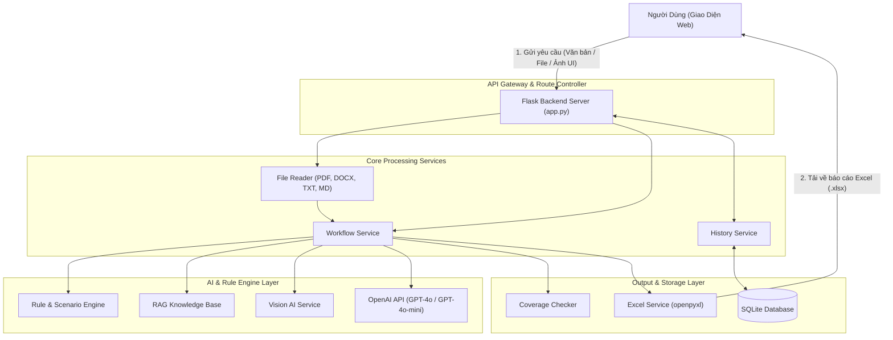

# AI Test Case Generator


**AI Test Case Generator** là một hệ thống thông minh hỗ trợ tự động hóa việc tạo lập bộ Test Case chuẩn hóa cho các ứng dụng Web từ nhiều nguồn đầu vào khác nhau: **mô tả nghiệp vụ bằng văn bản**, **tài liệu đặc tả (BRD/SRS)**, hoặc **hình ảnh giao diện người dùng (UI Screenshots/Wireframes)**.

Hệ thống kết hợp **LLM (OpenAI GPT-4o)** với **Rule Engine**, **RAG (Retrieval-Augmented Generation)**, và **Vision AI** nhằm nâng cao tính chính xác, tính đồng nhất và độ bao phủ kiểm thử (Test Coverage) trước khi xuất kết quả thành file Excel báo cáo hoàn chỉnh.

---

 Tính năng chính
- Sinh Test Case từ mô tả nghiệp vụ (Text Prompt)
- Phân tích các đoạn mô tả tự do, tự động bóc tách các chức năng chính/phụ và sinh kịch bản kiểm thử tương ứng.
- Sinh Test Case từ Tài liệu đặc tả (Specification Documents)**:
- Hỗ trợ định dạng: `.txt`, `.docx`, `.pdf`, `.md`.
- Tự động trích xuất nội dung và xây dựng ma trận Test Case cho toàn bộ tài liệu.
- Sinh Test Case từ Hình ảnh Giao diện (Vision AI)**:
- Hỗ trợ định dạng: `.png`, `.jpg`, `.jpeg`, `.webp`, `.gif`.
- Tự động nhận diện các thành phần UI (Form, Button, Input, Dropdown, Validation error...) để đề xuất Test Case tương ứng.
- Tích hợp Rule Engine & Scenario Rules**:
- Áp dụng các quy tắc kiểm thử tiêu chuẩn (Boundary Value, Equivalence Partitioning, Negative Testing, Security Basic).
- Tích hợp RAG (Retrieval-Augmented Generation)**:
- Tra cứu tri thức kiểm thử từ Knowledge Base để bổ sung kịch bản chi tiết.
- Kiểm tra & Báo cáo độ bao phủ (Coverage Report)**:
- Đánh giá mức độ hoàn thiện của các kịch bản và báo cáo tỷ lệ bao phủ theo chức năng.
- Chỉnh sửa & Sinh lại linh hoạt (Interactive Workspace)**:
- Cho phép chỉnh sửa tiêu đề, các bước thực hiện, kết quả mong đợi trực tiếp trên giao diện Web.
- Hỗ trợ sinh lại (Re-generate) cho từng Test Case đơn lẻ hoặc toàn bộ một nhóm chức năng.
- Xuất Excel chuyên nghiệp:
- Tự động đóng gói kết quả ra file `.xlsx` nhiều Sheet (Tổng quan, Chi tiết theo chức năng) được căn chỉnh giao diện chuẩn hóa.
- Quản lý Lịch sử (History Management)**:
- Lưu trữ toàn bộ các phiên sinh Test Case vào cơ sở dữ liệu SQLite, giúp tìm kiếm, mở lại và tải xuống báo cáo dễ dàng.

---
<div align="center">



</div>
## Cấu trúc thư mục
```text
deadlineAITaoTestCaseWebsite/
│
├── app.py                     # Entry point Flask Application & REST API Endpoints
├── requirements.txt           # Danh sách các thư viện phụ thuộc
├── .env.example               # File mẫu cấu hình biến môi trường
├── fix_titles (1).py          # Script tiện ích xử lý tiêu đề
│
├── database/                  # Quản lý cơ sở dữ liệu SQLite
│   └── database.py            # Khởi tạo DB & Schema lịch sử
│
├── services/                  # Các dịch vụ xử lý nghiệp vụ chính
│   ├── ai_service.py          # Tương tác OpenAI API & Prompt Engineering
│   ├── workflow_service.py    # Điều phối quy trình xử lý đa bước
│   ├── rule_engine.py         # Quy tắc kiểm thử tổng quan
│   ├── scenario_rule_engine.py# Quy tắc kiểm thử theo kịch bản chi tiết
│   ├── rag_service.py         # Dịch vụ Retrieval-Augmented Generation
│   ├── vision_service.py      # Phân tích hình ảnh UI với Vision AI
│   ├── file_reader.py         # Trích xuất văn bản từ DOCX, PDF, TXT, MD
│   ├── coverage_checker.py    # Phân tích & kiểm tra độ bao phủ Test Case
│   ├── coverage_report.py     # Tạo báo cáo độ bao phủ
│   ├── excel_service.py       # Xuất báo cáo định dạng Excel (.xlsx)
│   └── history_service.py     # Quản lý lưu vết lịch sử trên SQLite DB
│
├── rag/                       # Cơ sở tri thức kiểm thử (Knowledge Base)
│   └── knowledge/             # Tài liệu tri thức RAG
│
├── static/                    # Dynamic Static Files (CSS, JS, Images)
├── templates/                 # HTML Templates (Giao diện Web)
├── uploads/                   # Thư mục chứa các file người dùng tải lên
├── outputs/                   # Thư mục chứa các file Excel xuất ra
└── instance/                  # SQLite DB File (`history.db`)
```
---

## Hướng dẫn cài đặt & Khởi chạy
1. Yêu cầu tiền đề (Prerequisites)
- Python **3.10** hoặc cao hơn.
- Tài khoản OpenAI và **API Key** khả dụng.

2. Cài đặt môi trường
```bash
# 1. Clone repository (nếu chưa có)
git clone <repository-url>
cd deadlineAITaoTestCaseWebsite

# 2. Tạo môi trường ảo (Virtual Environment)
python -m venv .venv

# 3. Kích hoạt môi trường ảo
# Trên Windows:
.venv\Scripts\activate
# Trên Linux/macOS:
source .venv/bin/activate
# 4. Cài đặt các thư viện cần thiết
pip install -r requirements.txt
```
3. Cấu hình biến môi trường (.env)
Tạo file `.env` tại thư mục gốc của dự án (hoặc sao chép từ `.env.example`):
```bash
cp .env.example .env
```
Chỉnh sửa nội dung `.env`:
```env
OPENAI_API_KEY=sk-your-openai-api-key-here
OPENAI_MODEL=gpt-4o-mini
SECRET_KEY=your-custom-secret-key
```

4. Khởi chạy ứng dụng
```bash
python app.py
```

Sau khi khởi chạy thành công, mở trình duyệt web và truy cập:
**`http://127.0.0.1:5000`**

 Danh sách API Chính (REST Endpoints)
| Endpoint | Method | Mô tả |
| `/` | `GET` | Trả về giao diện chính của ứng dụng |
| `/api/chat` | `POST` | Sinh Test Case từ mô tả văn bản tự do |
| `/api/upload-file` | `POST` | Tải lên & trích xuất file tài liệu (`.pdf`, `.docx`, `.txt`, `.md`) |
| `/api/analyze-vision` | `POST` | Phân tích ảnh chụp màn hình UI và sinh Test Case |
| `/api/regenerate-single` | `POST` | Sinh lại 1 Test Case cụ thể dựa trên góp ý |
| `/api/regenerate-feature` | `POST` | Sinh lại toàn bộ Test Case của 1 nhóm chức năng |
| `/api/generate-excel` | `POST` | Xuất bộ Test Case hiện tại ra file Excel (`.xlsx`) |
| `/api/history` | `GET` | Lấy danh sách lịch sử các lần sinh Test Case |
| `/api/history/<id>` | `GET` / `DELETE` | Xem chi tiết hoặc xóa một mục lịch sử |
| `/download/<filename>` | `GET` | Tải xuống file Excel từ thư mục output |
---

 Hướng dẫn sử dụng chi tiết
1. Sinh Test Case bằng văn bản**:
   - Nhập mô tả chức năng vào ô chat (ví dụ: *"Tạo bộ test case cho chức năng Đăng ký tài khoản"*).
   - Bấm **Gửi**, hệ thống sẽ phân tích và hiển thị danh sách Test Case tổ chức theo từng tính năng.
2. Sinh Test Case bằng tài liệu**:
   - Nhấn nút **Tải file tài liệu** và chọn file đặc tả yêu cầu (`.pdf`, `.docx`...).
   - Nhấn **Phân tích**, hệ thống đọc nội dung tài liệu và tạo bộ Test Case tương ứng.
3. Sinh Test Case bằng hình ảnh**:
   - Tải lên hình ảnh giao diện Web/App.
   - AI Vision sẽ quét và nhận diện các form, nút bấm, validation để sinh bộ test chuẩn.
4. Chỉnh sửa & Xuất Báo cáo**:
   - Nhấp trực tiếp vào ô nội dung bất kỳ trong bảng preview để chỉnh sửa.
   - Nhấn nút **Xuất Excel** để tải về file Excel chuyên nghiệp.

---
## Giấy phép (License) & Tác giả
- Dự án được phát triển phục vụ mục đích nghiên cứu, học tập và hỗ trợ cộng đồng Tester/QA.
